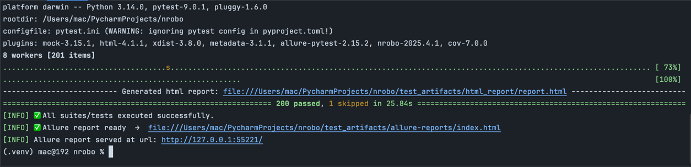

# 🤖 nrobo – NextGen Test Automation Framework

**nrobo** is a modular, YAML-driven test automation framework powered by PyTest, designed for web automation teams that value simplicity, flexibility, and CI/CD readiness.


---

[](https://github.com/pancht/nrobo/actions/workflows/ci.yml)
[](https://codecov.io/gh/pancht/nrobo)
[](https://github.com/pancht/nrobo/blob/production/LICENSE)
[](https://youtube.com/playlist?list=PLMkFSH7JcxPGXo5D3tesuUQcDqUPeE-ZL&si=uD3TCu6KpKDKV3G7)
[](https://pepy.tech/projects/nrobo)

# Architecture

> ℹ️ See [docs/architecture.md](docs/architecture.md) for the nRoBo architecture diagram and design details.

## 🚀 Features

- ✅ **PyTest-Powered Engine** – built on the rock-solid `pytest` foundation
- 📊 **Allure + HTML Reporting** – customizable test reports with logs and screenshots
- 🌀 **Integrated Nginx Allure Server** – serves Allure reports without needing the Allure CLI, and includes simple start, status, and stop commands for hassle-free report hosting
- 🖥️ **Selenium Web Integration** – cross-browser support (Chrome, Firefox, Edge)
- 🧱 **Modular Architecture** – decoupled loader, executor, and reporter components
- 📜 **YAML-Based Test Suites** – write tests in a human-readable format
## 🚀 Upcoming Features
- 🔧 **Reusable Steps & Configs** – DRY principle applied across suites
- 🔁 **Data-Driven Testing** – externalize inputs for flexible test coverage
- 🧪 **Self-Tested Framework** – internal tests for reliability
- 📦 **Modern Packaging** – install via `pip`, structured with `pyproject.toml`
- 🛡️ **Security Audited** – integrates with `bandit` and `pip-audit`
- ⚙️ **CI/CD Friendly** – GitHub Actions-ready out of the box

---


## 🧰 Pre-requisites

- Install Python (3.11 or higher)
  - python --version

## 📦 Installation

### Make a directory for automation project
```bash
  mkdir <test_project_name>
  cd <test_project_name>
```
### Install ***venv*** package
  - 🔵 macOS: No installation needed — macOS Python includes venv.
  - 🟢 Ubuntu / Debian Linux:
    - `sudo apt update`
    - `sudo apt install python3-venv`
  - 🔶 RedHat / CentOS / Fedora:
    - `sudo dnf install python3-venv`
  - 🟣 Windows: No installation needed — Also included by default.

###   Create virtual environment - `.venv`

```bash
  python -m venv .venv
```
### Activate virtual environment
  - Unix/Mac/Linux
    - `source .venv/bin/activate`
  - Windows
    - `.\\.venv\\Scripts\\activate`

### Install *nrobo*

```bash
  # Install nrobo
  pip install nrobo

  # initialize project
  nrobo init --app <project_name>

  # run sample tests
  nrobo # This will run sample tests
```

#### Other ways to work with `nrobo`
```bash
    # run tests disabled output capturing
    # means prints will not be captured and shows up on console right away
    nrobo -s

    # run 2 tests in parallel with disabled output capturing
    nrobo -n 2 -s

    # collect tests and show them on console. do not execute them!
    nrobo --co
```
**Or** Setup local development environment:

- [On MacOS](https://github.com/pancht/nrobo/wiki/Local-Development-Setup-(macOS))


## 🧪 Quick Start

```bash
# run login_test test suite only
nrobo --suite suites/login_test.yaml
```

## **Or** run via `pytest` if testing a local implementation:

```bash
nrobo -suite=suites/login_test.yaml
```

🧱 Directory Structure

```bash
nrobo/
├── src/nrobo/         ← Core framework (loader, executor, reporter)
├── suites/            ← YAML-defined test suites
├── tests/             ← Unit/integration tests for framework
├── docs/              ← Architecture docs, diagrams, examples
├── pyproject.toml     ← Packaging configuration
└── build_and_publish.py
```

# 📊 Reports

After execution, nrobo will generate html and allure report through integrated **pytest-html** and **pytest-allure** plugins.
nRobo will share following in console:
1. Link of html report
2. Link of allure report
3. Sets up local nginx server, and serve allure report for visualization with localhost url.



🛠️ Developer Guide

Run code checks:

```bash
black src/ tests/
flake8 src/ tests/
pytest --cov=src/
```

📚 Documentation

- Getting Started
- Writing Test Suites
- Architecture Diagram
- Extending nrobo

👥 Contributing

Want to add your own modules or reporters? Open a pull request or start a discussion!

- Fork this repo

- Create a feature branch

- Add tests for new logic

- Run `black`, `flake8`, and `pytest`

- Submit your PR with a detailed description

📝 License
MIT © 2025 pancht

[](https://github.com/pancht/nrobo/blob/production/LICENSE)
