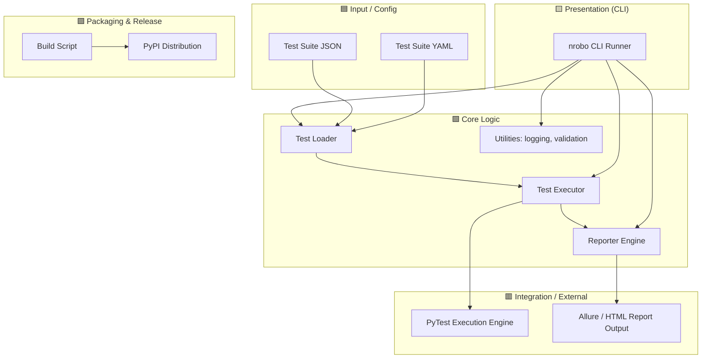

# nRobo — Architecture Overview

## High‑Level Architecture

```mermaid
flowchart TD
    %% Layer: Input / Config
    subgraph Input_Layer["🟦 Input / Config"]
        YAML[Test Suite YAML]
        JSON[Test Suite JSON]
    end

    %% Layer: Presentation
    subgraph Presentation_Layer["🟨 Presentation (CLI)"]
        CLI[nrobo CLI Runner]
    end

    %% Layer: Business Logic
    subgraph Business_Layer["🟩 Core Logic"]
        LOADER[Test Loader]
        EXEC[Test Executor]
        REPORT[Reporter Engine]
        UTILS[Utilities: logging, validation]
    end

    %% Layer: Integration / External
    subgraph Integration_Layer["🟥 Integration / External"]
        PYTEST[PyTest Execution Engine]
        ALLURE[Allure / HTML Report Output]
    end

    %% Layer: DevOps / Packaging
    subgraph Packaging_Layer["🟪 Packaging & Release"]
        BUILD[Build Script]
        PYPI[PyPI Distribution]
    end

    %% Data flow
    YAML --> LOADER
    JSON --> LOADER
    CLI --> LOADER
    CLI --> EXEC
    CLI --> REPORT
    CLI --> UTILS

    LOADER --> EXEC
    EXEC --> PYTEST
    EXEC --> REPORT
    REPORT --> ALLURE

    BUILD --> PYPI
```
